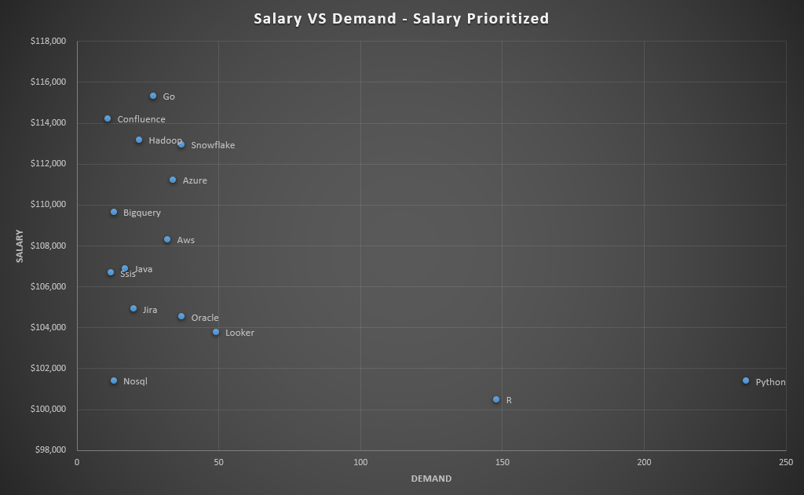
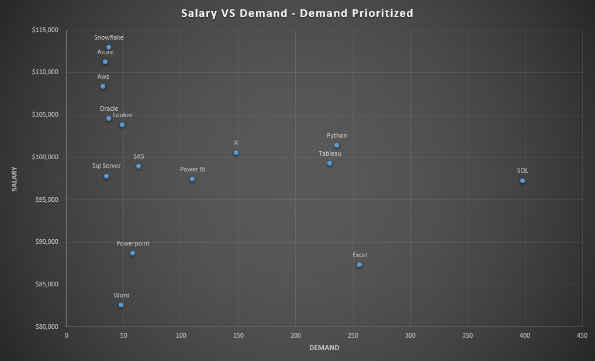

# Introduction
The goal of this project is to understand the Data Analyst job market. Specifically, looking at what are the top-paying jobs, in-demand skills, and where high demand meets high salary. In addition, I focused mostly on remote roles as that is the sector I am invested in.

Interested in the queries themselves? You can find them here: [SQL Qeueries Project Folder](https://github.com/Bnorval/SQL_Project_Data_Job_Analysis/tree/main/project_sql/SQL_Queries)
# Background
With a strong desire to learn more about the data analyst industry and job market, this project was made to streamline what skills are valuable. This is broken down into top-paid skills, in-demand skills, and both if applicable. This allows me and other users to streamline the learning process and narrow the scope for advancing in their Data Analyst career.

The data is provided by [Luke Barousse's SQL for Data Analytics Course](https://www.lukebarousse.com/sql). Luke is a talented Data Analyst who has put together a tool to gather data centered around a multitude of data based jobs. The CSV data files used for this analysis can be found on his website.

### The questions I wanted to answer through my SQL queries:
1. What are the top-paying data analyst jobs?
2. What skills are required for these top-paying jobs?
3. What skills are most in demand for data analysts?
4. Which skills are associated with higher salaries?
5. What are the most optimal skills to learn?

# Tools
For my insights on the data analyst job market, I utilized multiple key tools:
- **SQL**: The main basis of my analysis utilized SQL to query from the database and highlight key information to answer my questions.
- **PostgreSQL**: The chosen database management system.
- **Visual Studio Code**: My bread and butter for writing and executing SQL queries.
- **Git & GitHub**: Essential for documentation and ease of sharing for both my analysis and the queries that went into them.
# The Analysis
Each query for this project aimed at gaining insight on specific aspects of the data analyst job market. This is how I took on each question.

### 1. Top Paying Data Analyst Jobs
To identify the highest paying roles, I filtered down based on average salary. It is also filtered to remote jobs since that is my area of interest. This will narrow it down to the top 10 jobs utilizng the LIMIT option.

```sql
SELECT 
    j.job_id,
    j.job_title,
    c.name AS company_name,
    j.job_location,
    j.job_schedule_type,
    j.salary_year_avg,
    j.job_posted_date
FROM
    job_postings_fact j
LEFT JOIN company_dim c ON j.company_id = c.company_id
WHERE 
    job_title_short = 'Data Analyst'
    AND job_location = 'Anywhere'
    AND salary_year_avg IS NOT NULL
ORDER BY 
    salary_year_avg DESC
LIMIT 10;
```
<br>

#### Results:
| Title                                    | Company                                  | Salary     |
|------------------------------------------|------------------------------------------|------------|
| Data Analyst                             | Mantys                                   | $650,000   |
| Director of Analytics                    | Meta                                     | $336,500   |
| Associate Director- Data Insights        | AT&T                                     | $255,830   |
| Data Analyst, Marketing                  | Pinterest Job Advertisements             | $232,423   |
| Data Analyst (Hybrid/Remote)             | Uclahealthcareers                        | $217,000   |
| Principal Data Analyst (Remote)          | SmartAsset                               | $205,000   |
| Director, Data Analyst - HYBRID          | Inclusively                              | $189,309   |
| Principal Data Analyst, AV Performance Analysis | Motional                          | $189,000   |
| Principal Data Analyst                   | SmartAsset                               | $186,000   |
| ERM Data Analyst                         | Get It Recruit - Information Technology | $184,000   |

*Table showcasing the results of the top 10 data analyst roles*
#### Learnings:
- **Salary Range:** Filtering down to only the top 10, there is a large salary gap from the highest to the lowest paid. The top caps out at $650,000 and the lowest goes all the way down to $184,000 - a nearly $400,000 pay gap. This indicates a significant salary potential in the field.
- **Job Titles:** There is a couple different job titles among the top paying roles. Based on the data, you will either need to be a head analyst on the team, or become a director of the team to acquire a high salary.
- **Employers:** The employers for these roles are mostly made up of tech companies, showing that they are the leaders of this industry. Also among the employers is two healthcare companies indicating another strong option for data analyst roles.

### 2. Skills for Top Paying Jobs
Now that we have identified what are the top paying roles, we need to break it down what skills are being required for these roles. To do this, I joined the job postings with the skill data which provides the valuable insights we need.

```sql
WITH top_10_jobs AS (

    SELECT 
        j.job_id,
        j.job_title,
        c.name as company_name,
        j.salary_year_avg
    FROM
        job_postings_fact j
    LEFT JOIN company_dim c ON j.company_id = c.company_id
    WHERE 
        job_title_short = 'Data Analyst'
        AND job_location = 'Anywhere'
        AND salary_year_avg IS NOT NULL
    ORDER BY 
        salary_year_avg DESC
    LIMIT 10
)

SELECT
    t.*,
    sk.skills
FROM top_10_jobs t
INNER JOIN skills_job_dim sj ON t.job_id = sj.job_id
INNER JOIN skills_dim sk ON sk.skill_id = sj.skill_id
ORDER BY
    salary_year_avg DESC
```

After breaking down and analysing the results, a few key skills stand out. SQL had the highest freuquency
being required in 80% of the job postings. Python came in 2nd with 70% of the job postings, and Tableau
came in 3rd with 60% of the job postings. Other skills such as R and Excel also have a good number of 
listings, however the top three skills are clearly dominant over the rest.

This showcases a clear set of skills to focus on:
- SQL for database knowledge and querying
- Python for additional querying and statistical analyses
- Tableau for visualizng this data


*Bar graph visualizing the count of skills for the top 10 paying jobs for Data Analysts. This was narrowed down to at least 3 job postings per skill for visual clarity.*

### 3. In-Demand Skills for Data Analysts
This query helped identify the top skills being asked for remote data analysts. This time, its across all job postings to get a better understanding of the industry as a whole.

```sql
SELECT
    sk.skills,
    COUNT(sj.job_id) as demand_count
FROM job_postings_fact j
INNER JOIN skills_job_dim sj ON j.job_id = sj.job_id
INNER JOIN skills_dim sk ON sk.skill_id = sj.skill_id
WHERE
    job_title_short = 'Data Analyst'
    and job_location = 'Anywhere'
GROUP BY
    sk.skills
ORDER BY
    demand_count DESC
LIMIT 5
```
#### Results
| Skills    | Demand Count |
|-----------|--------------|
| SQL       | 7,291         |
| Excel     | 4,611         |
| Python    | 4,330         |
| Tableau   | 3,745         |
| Power BI  | 2,609         |

*Table showcasing the results of the top 5 skills query.*
<br>


Looking at the results of this query, there is some pattern changes when considering all pay ranges.
SQL, Excel, Python, and Tableau remain in the top 5. However, Power BI has replaced R as one of the top skills.
Excel also has taken 2nd place, surpassing Python in this ranking. R is also now missing from the top 5.
This showcases that while R is not as in demand, it can lead to a higher paying job. The key takeaway is that there is a need for a split set of skills:
- SQL for database management
- Excel for data analysis
- Python for statistical analyses.
- Tableau or Power BI as a data visualization tool.

Based on the data, this list makes up the core of a data analyst. It will be important to have all these skills
for an analysts career.

### 4. Skills Based on Salary
With this query, we are going to find out what is the average salary associated with each skill to see how it effects our list.

```sql
SELECT
    sk.skills,
    ROUND(AVG(salary_year_avg), 0) as average_salary
FROM job_postings_fact j
INNER JOIN skills_job_dim sj ON j.job_id = sj.job_id
INNER JOIN skills_dim sk ON sk.skill_id = sj.skill_id
WHERE
    job_title_short = 'Data Analyst'
    and job_location = 'Anywhere'
    and salary_year_avg IS NOT NULL
GROUP BY
    sk.skills
ORDER BY
    average_salary DESC
LIMIT 10
```
<br>

#### Results:

| Skills         | Average Salary |
|----------------|----------------|
| pyspark        | 208,172        |
| bitbucket      | 189,155        |
| watson         | 160,515        |
| couchbase      | 160,515        |
| datarobot      | 155,486        |
| gitlab         | 154,500        |
| swift          | 153,750        |
| jupyter        | 152,777        |
| pandas         | 151,821        |
| elasticsearch | 145,000        |

*Table showcasing the results of the top 10 highest paid skills.*

<br>
Based on these results, we can identify a few key points:
- **Emphasis on Big Data Handling:** Big database tools such as PySpark & Databricks showcases a demand
for tools that can manage large amounts of a variety of data.

- **Integration of Software Developement:** Many collaborative tools are found here such as Jenkins and
Gitlab. These tools are found in a variety of industries such as software or website
development. Being able to analyze data and collaborate with others is a big selling point.

- **Cloud computing and Machine Learning:** Cloud Platforms such as Kubernetes and machine larning libraries
like TensorFlow show the importance of newer technologies and AI solutions in the workforce.

### 5. Most Optimal Skills to Learn
Utilizing all the knowledge we gained from the past queries, we need to pinpoint the most optimal skills.
We will be defining optimal skills as those that are both high in demand and high in salary.

This can be qeuried two different ways:
- Prioritizing salary and then demand.
- Prioritizing demand and then salary.

An analyst may have favor salary or demand differently depending on where they are in their career, so let's analyze both methods. First we wil do salary prioritized.

Salary Prioritized
-

```sql
SELECT 
    sk.skill_id,
    sk.skills,
    COUNT(sj.job_id) AS demand_count,
    ROUND(AVG(j.salary_year_avg), 0) AS average_salary
FROM job_postings_fact j
INNER JOIN skills_job_dim sj ON j.job_id = sj.job_id
INNER JOIN skills_dim sk ON sj.skill_id = sk.skill_id
WHERE
    job_title_short = 'Data Analyst'
    AND salary_year_avg IS NOT NULL
    and job_location = 'Anywhere'
 GROUP BY
    sk.skill_id
HAVING
    COUNT(sj.job_id) > 10
ORDER BY
    average_salary DESC,
    demand_count DESC
LIMIT 15;
```


| Skills    | Demand Count | Average Salary |
|-----------|--------------|----------------|
| Go        | 27           | $115,320       |
| Confluence| 11           | $114,210       |
| Hadoop    | 22           | $113,193       |
| Snowflake | 37           | $112,948       |
| Azure     | 34           | $111,225       |
| Bigquery  | 13           | $109,654       |
| AWS       | 32           | $108,317       |
| Java      | 17           | $106,906       |
| SSIS      | 12           | $106,683       |
| Jira      | 20           | $104,918       |
| Oracle    | 37           | $104,534       |
| Looker    | 49           | $103,795       |
| NoSQL     | 13           | $101,414       |
| Python    | 236          | $101,397       |
| R         | 148          | $100,499       |

With our query on hand, let's plot this data onto a scatter graph to see what trends we can find.



*A visualization plotting the salary and demand of the top 15 jobs with salary prioritized.*
<br>
<br>


- **SQL & Excel:** These two skills were by far the highest demanded skills. However, they were unable to make it into the top 15 highest salary skills. A seasoned analyst focusing on a higher salary will have likely already developed these skills or are moving onto more specialized ones.

- **The Top Salaries:** The top paying skills do not have much variance in demand. Nothing makes it over 50 job postings reinforcing that these are niche but can be a big payoff if an analyst learns them. Snowflake, Azure, and GO will be the best skills to develop if aiming for over $110,000.
- **The Top Demand:** Python and R greatly outperform these high paying skills in demand, being well ahead of the curve. The only downside is that these are the two lowest paying salaries in the top 15. But if you're happy making just over $100,000 on average, these are great skills to develop.
<br>

Demand Prioritized
- 
```sql
SELECT 
    sk.skill_id,
    sk.skills,
    COUNT(sj.job_id) AS demand_count,
    ROUND(AVG(j.salary_year_avg), 0) AS average_salary
FROM job_postings_fact j
INNER JOIN skills_job_dim sj ON j.job_id = sj.job_id
INNER JOIN skills_dim sk ON sj.skill_id = sk.skill_id
WHERE
    job_title_short = 'Data Analyst'
    AND salary_year_avg IS NOT NULL
    and job_location = 'Anywhere'
 GROUP BY
    sk.skill_id
HAVING
    COUNT(sj.job_id) > 10
ORDER BY
    demand_count DESC,
    average_salary DESC
LIMIT 15;
```
| Skills      | Demand Count | Average Salary |
|-------------|--------------|----------------|
| SQL         | 398          | $97,237        |
| Excel       | 256          | $87,288        |
| Python      | 236          | $101,397       |
| Tableau     | 230          | $99,288        |
| R           | 148          | $100,499       |
| Power Bi    | 110          | $97,431        |
| SAS         | 63           | $98,902        |
| Powerpoint  | 58           | $88,701        |
| Looker      | 49           | $103,795       |
| Word        | 48           | $82,576        |
| Snowflake   | 37           | $112,948       |
| Oracle      | 37           | $104,534       |
| SQL Server  | 35           | $97,786        |
| Azure       | 34           | $111,225       |
| AWS         | 32           | $108,317       |



*A visualization plotting the salary and demand of the top 15 jobs with demand prioritized.*
<br>
<br>

There are some notable highlights compared to the last scatter plot. Let's go over them!
- The highly demanded roles are extremely far ahead of the high salaried roles. SQL is over 8x more demanded than the high salaried jobs.
- When it comes to the high demanded jobs, it can be difficult to break the barrier of making over $100,000. The salary for these skills such as R, Python, SQL, and Tableau cap out at $101,000 on average.
- There are some repeat skills that make both the top 15 demanded skills and top 15 highest salary skills. Notably Snowflake, Python, R, Azure, Oracle, and Looker. Those looking for a balance in demand and salary can target these skills to develop.
- An analyst utilizing this scatter plot trying to land their first job can quickly identify that SQL, Python, Tableau, and Excel can be a great starting point to enter the industry.

Bringing it All Together
-
Based on this analysis, there is no truly optimal skill. As jobs seek higher demand, the average salary for them trends downard. This trends sharply as you get to the truly high demanded jobs. With this knowledge, an analyst will have to understand what they want to prioritize when learning something new. Do they want to target a skill that will get them a higher salary, or do they want one that will land them a job easier?


# Conclusion
From this analysis, several patterns revealed themselves.
1. The core of the data analyst should be made up of multiple skills: Database querying (SQL), data analysis tools (R, Python, Excel), and data visualization (Tableau or Power BI).
2. Outside of these core skills, an analyst can carve out a niche for themselves by picking up a high paying but lower demanded skill such as GO or Hadoop.
3. The pay range for a data analyst can be quite varied, averaging in $90,000 - $110,000 range but being able to pay up to $650,000.
4. In order to become a very high paid analyst, you must be prepared to be the best in your role or be ready to take on the skills needed to become a director.

Closing Thoughts
-
This analysis has been a great resource for myself as a job seeker, and many other data analysts out there whether they be entering the industry or trying to upgrade their skillset. We only have so much time in our day to dedicate to learning new things, so streamlining the process and being able to target exactly what we want is very helpful. This exmploration showcases the importance of constant learning and paying attention to trends in the job market.